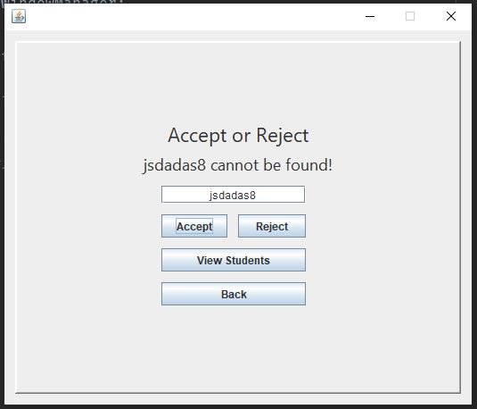

# Student Admissions

## Description

Hello, this is an old project. It is a simple Java GUI app where you can apply a student based on the information you input _(With validation of input in the background)_. Furthermore, you can accept or reject students if you're on the _Admissions Officer_ menu. There's also a page where you can view all students that are applying and pending for registration. 

## Images of the Application

### User Type Menu

### Student Menu

### Student Information Menu

### Admissions Officer Menu

### View Students Menu

### Accept or Reject Student Menu

